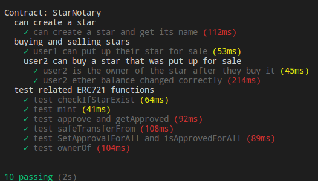

# Udacity Blockchain Project 5
## Decentralized Star Notary on Rinkeby

## Explaination based on project rubric

### Write a smart contract with functions
All the required solidity code can be found in the contracts folder

### Test smart contract code coverage
All the required test code can be found in the test folder, StarNotaryTest.js. In addition to the test code provided by the starter code, I added a test case for each ERC721 function

Proof of successful test:


To run the test, please do the following:
1. ```npm install -g truffle```
2. ```npm install -g ganache-cli```
3. run ```ganache-cli``` on a terminal, so we have a private ethereum blockchain mock on our pc
4. run ```truffle test``` inside smart_contracts folder

### Deploy smart contract on a public test network (Rinkeby)
Smart Contract Address: 0x258a5986cad866eccd053211c98357b358a07bd1

Create Contract Txn: 0x639c56bab1544bd13fa533198ff1a80f16671222cb41f06c467b736bb6649f8b

I've already created 5 stars. The first star creation (with tokenid 1) txn is 0x5390d23d633b1e2b7da86b35041ba55f0d7928b9977fc7b910f7384a3ecc8782

And it is put for sale in txn 0xa251bb8548456423484b5da6a05ad41a4c27f15e98e54d81cd0acd6ace9a882f

### Modify client code to interact with a smart contract
To run the front end UI, do the following:
1. npm install -g http-server
2. Go the the github repo root directory, run http-server .
3. Open browser, go to this url: http://127.0.0.1:8080/

So you can create (lookup) stars from the UI.
Note: I have already create 5 stars, the first star is like {name : "star1", ra : "ra1", dec : "dec1", mag : "mag1", story : "story1", tokenId : 1}
For star2, just change all the 1 to 2. If you create the another star with the same coordinate it will fail.

